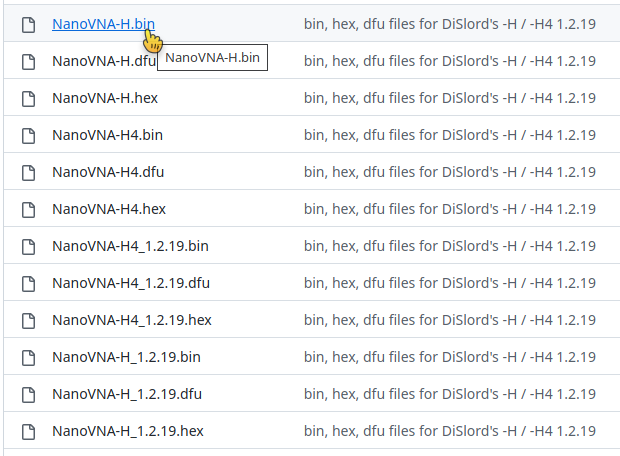
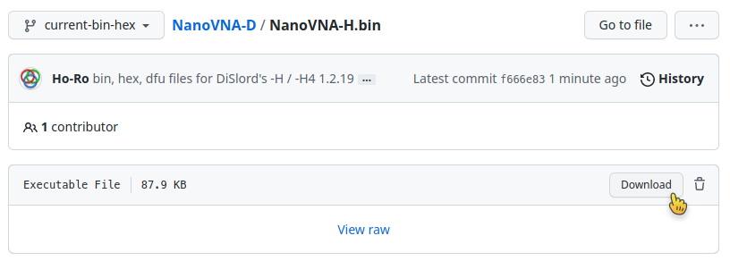

# How to download firmware files

Downloading files from GitHub must always be done in two steps - please **DON'T right click!**

1. On the main page of a GitHub repository, make a **left click** on the file name.

2. This opens a detail page about this file, where you can **left click** on `Download`

